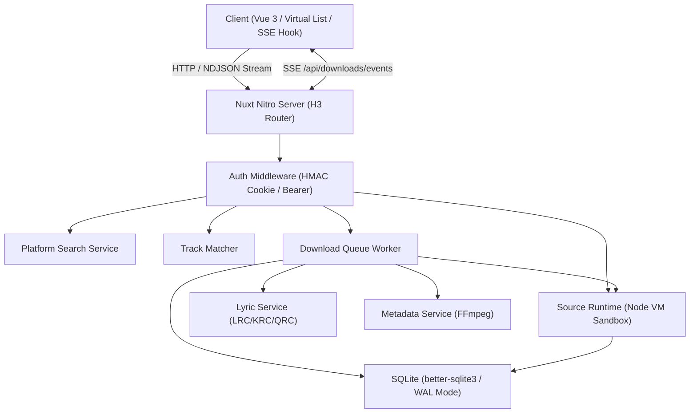

# Repository Guidelines

Miyin (觅音) is a full-stack music aggregation, resolution, and batch downloading service built with Nuxt 4 (Vue 3 + Nitro). It runs as a standalone Node.js service, multi-architecture Docker container, or native fnOS (TRIM OS) FPK package.

---

## Project Overview

- **Multi-Platform Search & Aggregation**: Aggregates music search and metadata across WangYi (`wy`), Kuwo (`kw`), Kugou (`kg`), Tencent/QQ Music (`tx`), and Migu (`mg`) via public endpoints and custom Lx-music-compatible JavaScript source scripts.
- **Sandboxed Custom Source Engine**: Evaluates untrusted user/community source scripts in isolated Node `vm.Script` execution environments with timer budgeting, network filtering, and module blacklisting.
- **Smart Track Matching & Downloader**: Fuzzy track metadata matching (Levenshtein distance, artist normalization, duration tolerance), multi-threaded download queue, binary audio header sniffing, preview clip detection heuristics, lyric decryption (LRC, KRC, QRC), and metadata/cover embedding via FFmpeg.
- **fnOS Native Integration**: Direct integration with fnOS shared storage permissions, wizard configuration, and reverse-proxy gateway routing over Unix domain sockets.

---

## Architecture & Data Flow



### Core Request & Task Flows

1. **Search Flow (`POST /api/search`)**: Dispatches concurrent upstream search requests via `platformSearch.ts` with loose JSON/JSONP parsers and artist sanitization.
2. **Audio URL Resolution (`musicUrlResolve.ts`)**: Queries active sources from `sourceRegistry.ts` $\to$ executes target provider in `sourceRuntime.ts` (`vm.Script`) $\to$ sniffs audio type and validates preview thresholds.
3. **Batch Playlist Matching (`POST /api/playlist/match`)**: Parses playlist links (NetEase/QQ) $\to$ matches track candidates across sources using `trackMatcher.ts` $\to$ enqueues tasks into SQLite.
4. **Download Lifecycle**: `downloadQueue.ts` worker loop polls `pending` tasks in SQLite $\to$ streams chunks to temporary files $\to$ checks audio magic bytes (`audioSniff.ts`) $\to$ verifies duration against preview cutoffs (`audioPreview.ts`) $\to$ decrypts lyrics (`lyricService.ts`) $\to$ embeds cover/ID3 tags with FFmpeg (`metadataService.ts`) $\to$ commits target file and broadcasts updates via SSE.

---

## Key Directories

```
miyin/
├── app/                  # Frontend: Vue 3 pages, components, composables, assets
│   ├── composables/      # useAuth, useDownloadEvents (SSE), usePlayer, useFnOsDirAuth
│   └── pages/            # index (search), playlist, queue, sources, settings, login
├── server/               # Backend: Nitro server engine
│   ├── api/              # API route handlers (/api/search, /api/downloads, /api/sources, etc.)
│   ├── middleware/       # Auth enforcement and request validation
│   ├── services/         # Core business logic (downloadQueue, sourceRuntime, lyricService, etc.)
│   └── utils/            # DB client, crypto, paths, audio sniffing, NDJSON stream helpers
├── shared/               # Shared isomorphic TypeScript types, platform IDs, and constants
├── packaging/fnos/       # fnOS FPK build scripts, lifecycle hooks, manifest, socket entry
├── scripts/              # Release automation, changelog generation, brand rendering
└── tests/                # Vitest unit and integration test suites
```

---

## Development Commands

### Daily Workflow

- **Start Dev Server**: `pnpm dev` (listens on `http://localhost:18980`)
- **Run Typecheck / Prepare**: `pnpm postinstall` or `npx nuxt prepare`
- **Run Tests**: `pnpm test` (executes `vitest run`)
- **Run Specific Test**: `pnpm vitest run tests/trackMatcher.test.ts`
- **Run Tests in Watch Mode**: `pnpm vitest`
- **Test Coverage**: `pnpm vitest run --coverage`

### Build & Release

- **Production Build**: `pnpm build` (outputs to `.output/`)
- **Preview Production Build**: `pnpm preview`
- **Build fnOS FPK Package**: `pnpm build:fpk` (runs `packaging/fnos/scripts/build-fpk.sh`)
- **Execute Release**: `pnpm release` (runs `scripts/release.sh` for semver bumps, changelog generation, and tagging)

---

## Code Conventions & Common Patterns

### 1. Database & Persistence (`server/utils/db.ts`)
- Access SQLite synchronously via `better-sqlite3` with WAL mode enabled.
- Always retrieve the active database instance through `getDb()`.
- Run migrations on startup in transaction blocks inside `server/utils/db.ts`.

### 2. Sandbox Execution & Error Isolation (`server/services/sourceRuntime.ts`)
- Untrusted user scripts must run inside Node's native `vm.Script` with strict context sandboxing.
- Never grant scripts access to `process`, `require`, `fs`, `child_process`, or internal network modules.
- Use `AsyncLocalStorage` (`sourceLogContext`) to capture console logs and route execution telemetry without polluting stdout.

### 3. Asynchronous & Streaming Patterns
- **Server-Sent Events (SSE)**: Use `server/api/downloads/events.get.ts` with `h3` event stream helpers for real-time task queue updates.
- **NDJSON Streaming**: Use `server/utils/ndjsonStream.ts` (`createNdjsonStream`) to stream line-delimited progress objects for long-running batch operations (source testing, batch imports).

### 4. Audio Verification & File Safety
- **Audio Sniffing (`server/utils/audioSniff.ts`)**: Always verify actual audio file headers (`ID3`/`fLaC`/`OggS`/`ftyp`/`RIFF`) before renaming or tagging downloaded buffers.
- **Preview Rejection (`server/utils/audioPreview.ts`)**: Block files under preview duration/size thresholds (e.g. 30s/60s cuts) when full tracks are requested.

### 5. Authentication & Environment Precedence (`server/utils/runtimeEnv.ts`)
- Use `server/utils/runtimeEnv.ts` to access environment variables. Precedence: `process.env.*` > `runtimeConfig.*`.
- Auth mode dynamically switches: if `AUTH_TOKEN` is unset or empty, the server operates in open mode without login redirects.

---

## Important Files

| File Path | Description |
|---|---|
| `nuxt.config.ts` | Nuxt 4 configuration, Nitro node-server preset, base URL normalization, externalized `better-sqlite3`. |
| `package.json` | Project dependencies, engines (`node >=22`), package manager (`pnpm@10.28.0`), and scripts. |
| `vitest.config.ts` | Vitest configuration with forks pool, test environment timeouts, and `#server`/`#shared` aliases. |
| `server/utils/db.ts` | SQLite connection singleton and schema migrations. |
| `server/services/sourceRuntime.ts` | Node VM sandbox runner for custom music source scripts. |
| `server/services/downloadQueue.ts` | Singleton queue manager and worker scheduler for file downloads. |
| `server/services/trackMatcher.ts` | Fuzzy track matching algorithm using Levenshtein distance and duration tolerances. |
| `packaging/fnos/server-entry.mjs` | fnOS native gateway reverse proxy bridging Unix domain sockets to internal Nitro TCP. |
| `.env.example` | Template for environment variables (`AUTH_TOKEN`, `DATA_DIR`, `DOWNLOAD_DIR`, `PORT`, etc.). |

---

## Runtime & Tooling Preferences

- **Node.js**: Requires **Node.js >= 22** (enforced in `package.json` engines, `.nvmrc`, Dockerfile, and GitHub Actions).
- **Package Manager**: **pnpm** (v10.28.0+, managed via Corepack). Do not use npm or yarn.
- **Native Addons**: `better-sqlite3` is compiled natively against host architecture. It is externalized in Nitro server build configs.
- **System Binaries**: `ffmpeg` is required at runtime for audio tag writing, cover art embedding, and transcoding.
- **Path Aliases**:
  - `#server/*` $\to$ `./server/*`
  - `#shared/*` $\to$ `./shared/*`
  - `~/*` or `@/*` $\to$ `./app/*`

---

## Testing & QA

- **Framework**: Vitest v4 with node test environment and `forks` pool.
- **Mocking Philosophy**: Avoid mocking libraries (`vi.mock`/`vi.spyOn`). Instead, tests rely on:
  - Real in-memory or temporary disk SQLite databases (`mkdtempSync`).
  - Synthetic inline LX source script templates executed inside real VM sandboxes.
  - Real binary byte buffers for audio sniffing and FLAC header embedding.
- **Lifecycle Cleanup**:
  - Always call `resetSourceRuntimeState()` in `beforeEach`/`afterEach` hooks when testing source runtime scripts.
  - Reset or close database handles (`closeDb()`) between stateful integration test runs.
- **Coverage**: All critical business logic (sandboxing, track matching, lyric decryption, download retry classification, audio sniffing) must maintain comprehensive test coverage across `tests/*.test.ts`.
